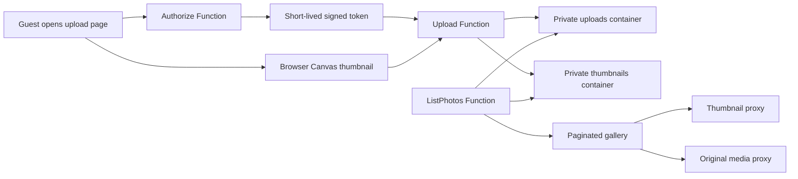

## Status

Validated

## Objective

Limit party uploads to a fixed upload window while improving gallery performance
through private thumbnails and server-side pagination.

Add authenticated administration routes for listing, downloading, and deleting
original media without enabling public Storage networking.

## Confirmed Decisions

* Allow uploads without a password while the configured upload window is open
* Open uploads on July 25, 2026 at 12:00 PM Eastern
  (`2026-07-25T16:00:00Z`)
* Close uploads on August 8, 2026 at 11:59 PM Eastern
  (`2026-08-09T03:59:00Z`)
* Issue signed upload tokens with a maximum lifetime of 12 hours
* Generate 480 px WebP gallery thumbnails asynchronously
* Display 25 images per page by default
* Offer 25 and 50 image page sizes
* Sort images newest first
* Load original media only when the lightbox opens

## Architecture



## Application Changes

### Upload Authorization

* Add `POST /api/authorize` to issue a signed session while uploads are open
* Reject authorization before the opening time and after the closing time
* Return an HMAC-signed token containing issued-at and expiry timestamps
* Store the token in browser `sessionStorage`
* Require `Authorization: Bearer <token>` on `POST /api/upload`
* Revalidate token signature, expiry, and the upload window on every upload
* Display a closed message outside the configured upload window

### Upload Safety and Performance

* Stream multipart content to Blob Storage instead of buffering complete files twice
* Enforce supported image and video content types
* Enforce configurable file-size limits before and during upload
* Preserve the current private-storage and managed-identity design
* Keep gallery viewing public and separate from upload authorization

### Thumbnail Processing

* Generate image thumbnails with the browser Canvas API before each upload
* Skip videos and browser-unsupported image formats
* Resize images to fit within 480 px while preserving aspect ratio
* Encode thumbnails as WebP
* Send the thumbnail and original in the same authenticated multipart request
* Write thumbnails to a separate private `thumbnails` container
* Record thumbnail readiness on the original blob
* Add `GET /api/thumbnail/{blobName}` to stream thumbnails from private storage

> [!NOTE]
> The approved event-driven design required the native `sharp` package. The organization
> blocks access to the public npm registry, so browser-native thumbnail generation avoids
> a new dependency while preserving private storage and fast gallery cards.

### Gallery Pagination

* Change `GET /api/photos` to accept `page` and `pageSize`
* Allow page sizes of 25 or 50 and default invalid values to 25
* Return an object containing `items`, `page`, `pageSize`, `total`, and `totalPages`
* Sort the expected party-sized collection newest first before slicing the requested page
* Use thumbnail proxy URLs for gallery cards
* Use original media proxy URLs only in the lightbox
* Add previous and next controls plus a 25/50 page-size selector
* Reset to page 1 when the page size changes

> [!NOTE]
> Blob Storage does not provide reverse chronological continuation tokens. For the
> expected collection of hundreds of files, listing properties, sorting, and slicing is
> appropriate. A Table Storage catalog becomes worthwhile if the collection grows into
> tens of thousands of items.

## Azure Configuration

Add these Function App settings without committing secret values:

```text
UPLOAD_TOKEN_SECRET=<cryptographically random 32-byte secret>
UPLOADS_OPEN_AT=2026-07-25T16:00:00Z
UPLOADS_CLOSE_AT=2026-08-09T03:59:00Z
UPLOAD_TOKEN_TTL_SECONDS=43200
THUMBNAIL_CONTAINER_NAME=thumbnails
MAX_IMAGE_BYTES=20971520
MAX_VIDEO_BYTES=78643200
```

Provision and configure:

* Private `thumbnails` blob container
* Existing user-assigned managed identity access to thumbnails
* Application Insights telemetry for authorization failures, upload duration,
  thumbnail duration, and processing failures

## Validation

1. Verify an incorrect code returns `401` without revealing which check failed.
2. Verify the correct code returns a signed token only inside the upload window.
3. Verify missing, altered, and expired tokens cannot upload.
4. Verify the server rejects uploads outside the configured window.
5. Verify oversized and unsupported files are rejected with clear responses.
6. Upload a JPEG and confirm the original remains private.
7. Confirm the authenticated upload stores a 480 px WebP thumbnail.
8. Confirm the gallery uses the thumbnail proxy for cards.
9. Confirm the lightbox retrieves the original through the media proxy.
10. Create more than 25 test records and verify newest-first paging and the 25/50 selector.
11. Verify the Jekyll build and GitHub Pages deployment succeed.
12. Run a focused concurrent upload test and inspect Application Insights failures,
    duration, memory, and scale behavior.

## Deployment Sequence

1. Update the feature branch from `main`.
2. Implement and locally validate authorization helpers and Functions.
3. Implement the upload gate and paginated gallery.
4. Add browser thumbnail processing without external dependencies.
5. Configure non-secret settings, secret settings, and the thumbnail container.
6. Validate Azure readiness and managed-identity access.
7. Deploy the Function App and run API integration checks.
8. Commit and push the application changes.
9. Merge through a pull request to trigger GitHub Pages.
10. Verify the public upload and gallery workflows.

## Validation Proof

Validation completed on July 20, 2026.

* `npm --prefix birthday90-functions test`: 9 tests passed
* `node --check` on all Function source files: passed
* Browser script parsing for both birthday pages: passed
* VS Code diagnostics for the workspace: no errors
* `git diff --check`: passed
* Function resource state: `Running` on Flex Consumption with a user-assigned identity
* VNet integration: connected to `vnet-birthday90/snet-functions`
* Storage network access: public network access disabled
* Storage authentication: shared-key access disabled and TLS 1.2 required
* Managed identity authorization: Storage Blob Data Contributor confirmed
* Existing settings: `STORAGE_ACCOUNT_NAME` and `BLOB_CONTAINER_NAME` configured

The application is ready for deployment. Production secret values remain outside the
repository and must be written directly to Function App settings.

### Administration validation proof

Validation completed on July 23, 2026.

* `npm --prefix birthday90-functions test`: 11 tests passed
* `node --check` on the administration Function and browser script: passed
* VS Code diagnostics for the administration page and Function source: no errors
* `git diff --check`: passed
* Function managed identity: `Storage Blob Data Owner` confirmed
* Storage network access: public network access disabled
* Storage authentication: shared-key access disabled
* Administration routes: Function-level authorization configured
* Destructive behavior: delete removes the selected original and associated thumbnail only

## Deployment Proof

Deployment completed on July 20, 2026 in the confirmed East US environment.

* Created the private `thumbnails` container with public access disabled
* Wrote all eight production settings directly to the Function App
* Published the JavaScript package with Azure Functions Core Tools
* Confirmed host state `Running` and all six HTTP triggers indexed
* Confirmed `GET /api/upload-status` returns `not_open` before July 25
* Confirmed `POST /api/authorize` returns `403` before the upload window
* Confirmed `POST /api/upload` returns `401` without a token
* Confirmed paginated and legacy photo-list response formats
* Confirmed media proxy returns `206` for a valid byte range
* Confirmed media proxy returns `416` for an unsatisfiable byte range
* Confirmed production Blob Data Contributor role after deployment

## Rollback

* Redeploy the previous Function package if authorization or media APIs regress
* Disable uploads immediately by setting the close time to the current time
* Leave original blobs unchanged if thumbnail processing fails
* Revert the Pages commit to restore the previous gallery client

## Approval

Implementation and Azure resource changes begin only after explicit approval.