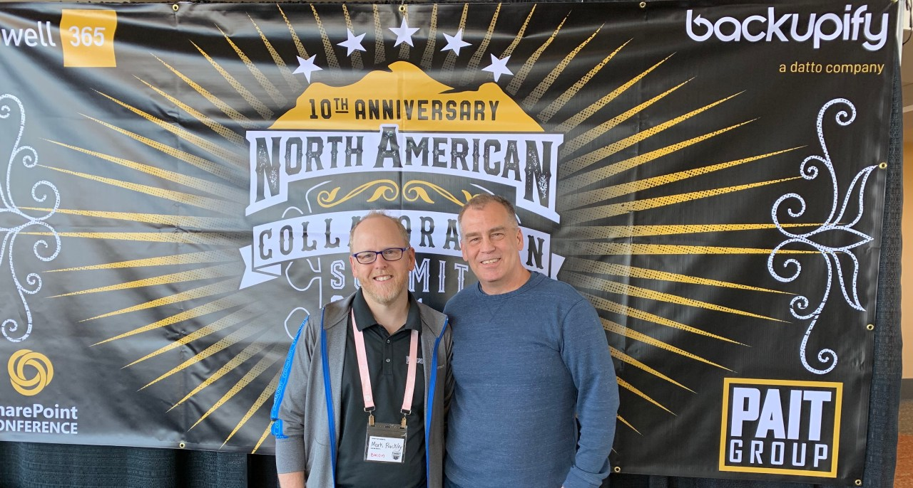

---
title: North American Collaboration Summit 2019 Recap
date: 2019-03-24 08:00:00 -0700
categories: [events]
---

### aka "Confessions from an attendee of the North American Collaboration Summit 2019"

The North American Collaboration Summit was hosted by the "Bacon man" Mark Rackley March 14-16, 2019 in the beautiful city of Branson, Missouri. The Collaboration Summit celebrated its 10th anniversary this year. They had CAKE. Oh, and they served bacon in the morning too.

This was my first trip in Branson and the first SharePoint conference in quite some time. Branson is a nice small town along the banks of Lake Taneycomo. If you have never been, you owe it to yourself to add this city to your bucket list.

Mark Rackley did an amazing job of bringing together the best and brightest (both in speakers and attendees) to his event. The conference was a great mix of SharePoint, Microsoft Teams, and Microsoft Azure discussions and demos at various depths. I attended a myriad of sessions to both learn and to be able to see and hear the speakers that I follow on social media. The big buzz of the MVP summit in Redmond the following week did not distract the speakers from presenting awesome content and conversation throughout.

The sessions that I attended were:
- List / view formatting in O365 using JSON - Chris Kent
- Next Level Forms with PowerApps - April Dunham
- Using Azure Runbooks and Microsoft Flow to Automate SharePoint Tasks - Geoff Varosky
- Unlocking Your Microsoft 365 Data with Graph Data Connect - John White
- Mastering Azure Functions for SharePoint - Bob German
- How to Run a Search Project in SharePoint - Matthew McDermott
- Building PowerApps on top of Azure SQL - Shane Young
- Introduction to SharePoint Webhooks with Azure Functions, Queues, and Tables - Don Kirkham

All of the sessions were well presented with a great mix of slides and demos. I hope to be able to speak at SharePoint sessions in the near future, I took a good number of notes about presentation styles and content.

In the middle of the day, there were keynote addresses by Mark Kashman, speaking and demoing about the "inner" and "outer" rings of the collaboration space within SharePoint, OneDrive, Teams, Yammer and Outlook. Mark also gave the audience a preview of the GA released "Live Events" in Teams with the audience participating on their mobile devices. There were, of course, SharePoint sock giveaways during the sessions as well.

Thursday night was the Collaboration Summit welcome event at the Paddle Wheel, an actual floating pub, within walking distance from the hotel. Mark threw an awesome gathering where attendees and speakers were able to mingle, eat, and even listen to live music (with a special guest singer April Dunham on stage for a few songs). I was able to meet John from St. Louis and we discussed AI and Machine Learning in healthcare and ate some choice BBQ as well.

Friday brought more sessions, discussions and chance meetings. Sandy Ussia happened to be walking by me while on a break, and I asked her a question regarding Microsoft Flow and eliminating nulls from a string. She and I had a great conversation, resulting in the start of a following of each other to learn more and share solutions. My next post will share the solution she helped me with.

Besides learning new things, this conference was important to me because I was able to meet some people that had previously existed to me only virtually. I was finally able to shake Nate Chamberlain's hand. Tracy van der Schyff - who flew from South Africa, showed off her awesome arm of Microsoft tattoos. Sue Hanley and I discussed the benefits of using Office Lens to flatten projector screen shots while in the audience. I met a teacher that was attending the event and referred him to Brian Dang on Twitter; explaining that he was a teacher and writes about Power Apps and education. I shared with him my excitement of having Shane Young and April Dunham here for PowerApps. Being extroverted is not natural for me, but I introduced myself and said hello to people. I enjoyed the openness and the interaction.

Attending the North American Collaboration Summit also gave me the opportunity to finally meet Stephanie Donahue in person. Stephanie is my mentor. During the Ignite 2018 event, I signed up for the Diversity and Tech mentor program from Microsoft and I was contacted in December 2018 and was matched with Stephanie. The mentoring that she provides is insightful, thought provoking, direct and appreciated. The opportunity to ask questions of a practice owner, and to understand what her commitment to the industry brings, makes me grateful for the connection. The fact that I have met a new friend in the community, "Priceless". I will continue to advocate for this opportunity Microsoft has provided me.

Although the session days were long and the information vast, I left Branson very energized and excited to get back to work. The speakers made it very easy to approach them and talk. What became evident during the week was at a time where our industry is increasingly virtual, it is great to interact with fellow humans and witness human decency. There is no other word to describe these events but "community". No one is better, worse or smarter. We all have a story, and we all bring value. This is Microsoft, this is openness, this is awesome. The speakers, hosts, sponsors and attendees all contribute to the growth of our collective knowledge.

I am hopeful that the event will remain in Branson next year (and years following) because I have a plan to head back and enjoy more of this beautiful city and the awesome SharePoint community that gathers there.

Thank you to all the MVPs and contributors in our community. I will strive to provide that same level of commitment in my writing and actions.

As a note, Microsoft MVPs traveled from great distances to present in Branson - many using personal funds, all for the love of this community and commitment to their craft. I have added links to the presenters I had interactions with, but there are many more also worth following on Twitter. Do yourself a favor and look them up on social media or visit their blogs, as they all provide fantastic content.

