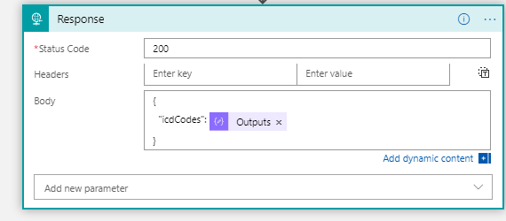
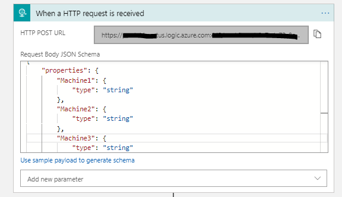
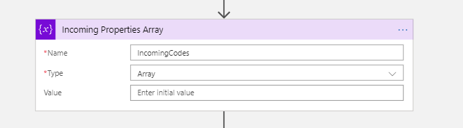
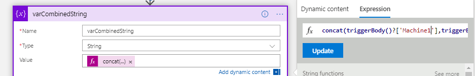
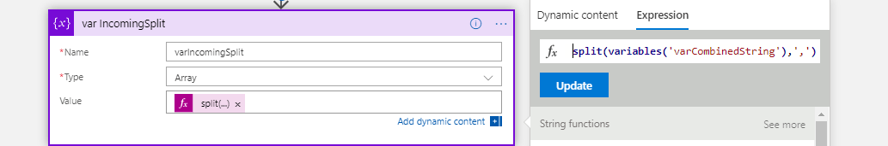
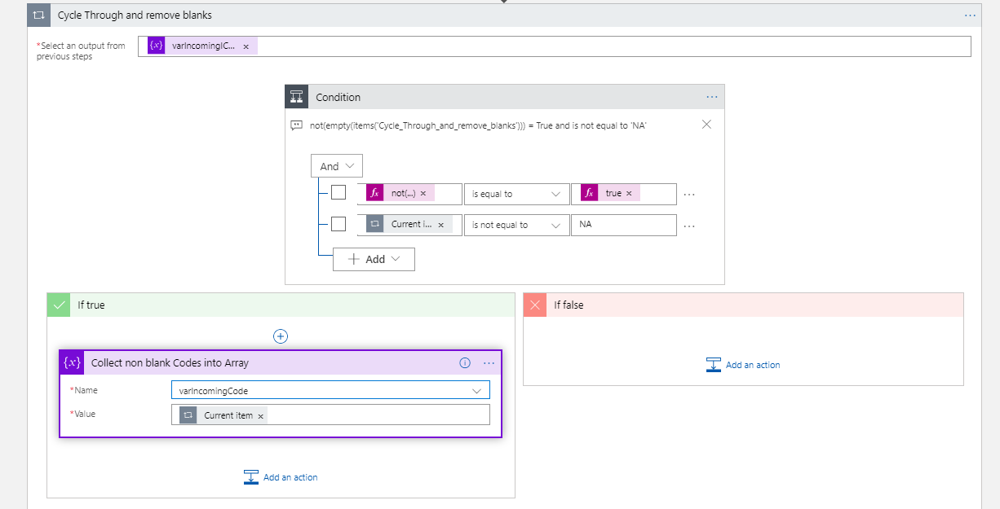
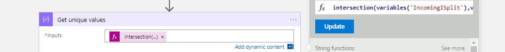

---
title: Finding unique values and remove null values with Logic Apps
date: 2019-04-03 08:00:00 -0700
categories: [infrastructure]
---


A few weeks ago, I had a need to take some streaming IoT data and find a list of unique code values it was returning. For each measurement in the database, a machine would record a string of certain codes that we needed to understand. Some measurements yielded a "null" which we needed to remove from the strings of data prior to analysis.

As an example, here is a sample set of values being sent from the device:

B1234,C45,C45,,G4552,H34425,A1234,,,,,,,H45,T3325,,,,Z44,H45,G4552

Our goal is to end up with a string of values that are free of null values and only unique codes. The extra commas are the result of null values being sent.

## Setting up the Logic App





1. Within Logic Apps, I have a HTTP trigger that will accept the codes from the device.

2. Create a variable to contain the string of values being received.

3. Create a large combined string that will hold all the machines values. This is done by concatenating all of the machine strings together.

4. Next split the new string and store it as an array.

```json
split(variables(‘varCombinedString’),’,’)
```
5. Create a loop to remove any of the "null" values in the array of values. This step was assisted by Sandy Ussia (@SandyU) who reminded me that you need to have a condition actually arrive at a decision of true or false.

```json
not(empty(items(‘Get_all_incoming_manged_properties’))) “is equal to” true
```
6. I used an expression called "Intersection" within a Compose to compare the original array to the new array without null values. This will return an array with only unique values, and best of all, no "nulls".

```json
intersection(variables(‘varIncomingSplit’),variables(‘IncomingCodes’))
```
7. Lastly, the cleansed array of codes is returned and is sent to another analysis step with the Response.

Again, I wanted to express my gratitude to the Flow and Logic Apps community for always being available for questions!

Good luck in your data cleansing and automation tasks.


